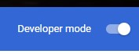
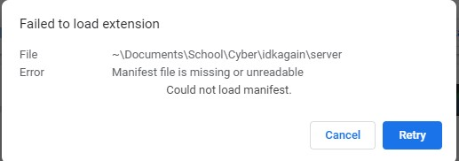
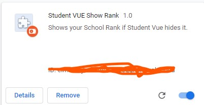

# Student Vure Ranking
This is an app that makes checking your school rank easier

## How to use:
- Download the Latest release(zip/tar whatever you want)
- Extract the archive
- Go to `chrome://extensions/` 
- Enable Developer Mode(Top Right corner)

- Click on load unpacked 

!(Unpacked)[unpacked.jpg]
- Navigate to the place where you unzipped her pa... I mean unzipped the release, and select the folder.
- If it says could not load Manifest, then you are a dumbass, Go to the folder inside the unzipped folder. 

- Something like this should show up 

- Then just make sure its enabled and go to student vue.
- If you could not do it and are a dumbass then tell me ill explain
